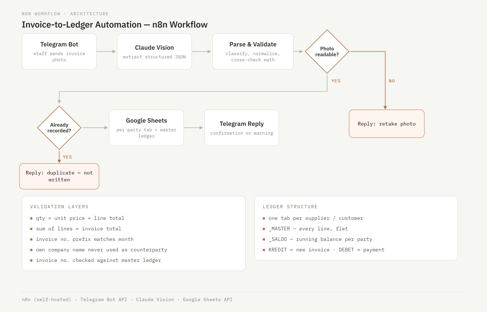

# n8n-invoice-to-ledger

Production **n8n** workflow running daily at a print shop in Tangerang, Indonesia.

Staff photograph a handwritten sales invoice, send it to a Telegram bot, and the line
items land in a Google Sheets ledger — routed to the right supplier or customer tab,
with running balances, duplicate detection, and arithmetic cross-checks.

**Stack:** n8n (self-hosted) · Telegram Bot API · Claude Vision · Google Sheets API



---

## The problem

A print shop tracked payables and receivables by hand: ~60 counterparties, hundreds of
handwritten invoices a month, transcribed into spreadsheets one line at a time. A single
mistyped digit surfaced months later as a balance that would not reconcile — and by then
nobody could tell which invoice it came from.

The obvious fix is OCR. The obvious fix is not enough.

## Why OCR alone fails here

Every one of these passed a "the text was read correctly" check and still produced
wrong books:

| What happened | Why it slipped through |
|---|---|
| `30.200` recorded as `30,2` | Digits read perfectly. Indonesian thousands separator is `.`, decimal is `,` — the model applied the English convention. Quantity off by 1000×. |
| Own company name written as the counterparty | On a *purchase* invoice the shop's own name sits in the recipient box. The model picked the only company name it could see. Result: a ledger tab named after the business itself. |
| `060043` read as `0S0043` | A single character. Enough to defeat duplicate detection, so the same invoice could be entered twice. |
| Month taken from the invoice number | The Roman numeral in the invoice number does not always match the invoice date. Both were legible; the wrong one was chosen. |

The common thread: **legibility was never the bottleneck.** A blurry photo announces
itself — the model flags it and the bot asks for a retake. A *sharp* photo of a
misinterpreted number enters the books silently. Silent errors are the expensive ones.

## What the system does instead

Validation runs on the extracted data, independent of image quality:

```
qty × unit price == line total          catches misread quantities and prices
Σ line totals    == invoice total       catches dropped or duplicated rows
first 2 digits of invoice no. == month  catches OCR character substitution
counterparty     != own company         catches recipient-box confusion
invoice no.      ∉ master ledger        catches double entry
```

A failed check does not silently drop the row. The bot writes the data and appends a
`PERLU DICEK` block naming the exact line and the arithmetic that disagrees, so a human
knows where to look.

## Ledger design

```
Piutang_Usaha_2026.xlsx        Hutang_Usaha_2026.xlsx
├── README                     (same structure)
├── _KODE       invoice-number prefix → full counterparty name
├── _MASTER     every line from every tab, flat — source for _SALDO and dedup
├── _SALDO      outstanding balance per counterparty
├── TEMPLATE    per-party tab structure
└── <PARTY>     one tab per supplier / customer, created on demand
```

`KREDIT` = new invoice · `DEBET` = payment · `TOTAL` = running balance.

Payments are recorded the way the shop's existing books do it: a row in the same tab
with the invoice number left blank and the method in the description —
`PEMBAYARAN PIUTANG USAHA (BCA)`. Payments are **not** matched to specific invoices,
because partial payments and combined settlements are routine; the ledger tracks a
running balance, not invoice-level settlement.

The running-balance formula is row-independent so n8n can write the identical string
on every row without knowing its position:

```
=SUM($G$2:INDIRECT("G"&ROW()))-SUM($H$2:INDIRECT("H"&ROW()))
```

## Workflow

15 nodes. Notable mechanics:

- **Expected-failure branching** — creating a counterparty tab fails when the tab already
  exists. That failure is routed through the node's error output and the flow continues,
  rather than treated as a fault.
- **Idempotent header write** — headers are written with `PUT` to `A1:I1` instead of an
  append, so re-running never stacks a second header row mid-table.
- **Fan-out / fan-in** — one invoice splits into N line items, each written as its own
  row, then aggregated back into a single confirmation message.
- **Cross-node data threading** — parsed invoice metadata is attached to every line item
  *before* the split, so no downstream node depends on reaching back across the graph.

See [`docs/n8n-techniques.md`](docs/n8n-techniques.md) for the full list, and
[`docs/failure-modes.md`](docs/failure-modes.md) for the bugs that produced them.

## Repository

```
code/           Code node contents (JS)
prompts/        Claude vision extraction prompt
sheets/         ledger structure and formulas
workflow/       exported n8n workflow JSON
docs/           architecture diagram, failure log, technique notes
```

## Note on this repository

Company names, invoice-number prefixes, spreadsheet IDs, and bot identifiers have been
replaced with placeholders. Real invoice images are not included — they contain customer
names, bank account details, and per-customer pricing.

This is a portfolio record of a working system, not a distributable template. Running it
elsewhere would require rewriting the classification rules, invoice-number format, and
document layout assumptions, all of which are specific to one business.
